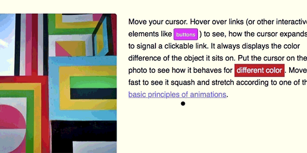

# RubberJS
Alternative cursor, animated like a rubber ball.  
Move it fast and it will squash and stretch.  
Hover over interactive elements and it scales up for indication.  
  


## Usage
Embed and initiate, easy as that.
```html
<script src="rubber.js"></script>
<script> let rubber = new Rubber() </script>
```
It will fetch a list of native interactive elements on its own, you can add the data-rubber attribute to elements that shall be marked as such additionally.  

## Options
Options are passed as object (eg `<script> let rubber = new Rubber({ minWidth: 960 }) </script>`)  
  
### **minWidth** *(number)*  
The minimum width the browser window needs for it to display. On mobile we want it disabled of course, as there's no cursor.  
*Default: 1280*
  
### **minWidth** *(array of string)*  
The minimum width the browser window needs for it to display. On mobile we want it disabled of course, as there's no cursor.  
*Default: ['a', 'input', 'select', 'button', 'textarea', 'label[for]', '\*[data-rubber]']*
